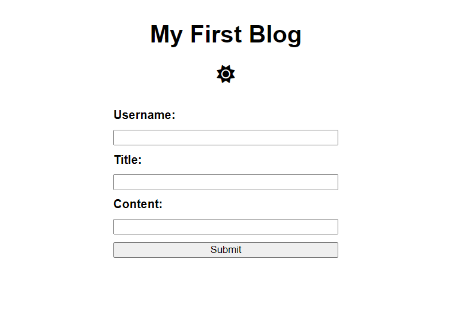
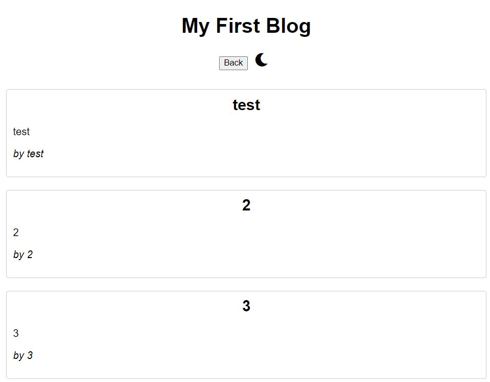

# Personal-Blog
This repo creates a webpage for a WEB API powered two-page blog.

## Description
This app is a WEB API powered two-page blog. With this app, a user can enter a username, a title, and content for a blog. After hitting submit, the user is then taken to the blog page, where the blogs are locally stored and displayed. They can then press the button to submit more blogs. Both pages contain mode toggle buttons that can change the page from light mode to dark mode and vice versa.

The purpose of this project was to utilize the Web API tools learned during Module 4, primarily when it comes to using javascript for storing and retrieving local data, creating buttons, and creating a form.

## Usage

In order to access the deployed website, click the following link: [https://nearias3.github.io/Personal-Blog/]

 

## Credits

Useful information about coding, including tutorials and guides, were provided by the UT Bootcamp GitLab: [https://git.bootcampcontent.com/University-of-Texas-at-Austin/UTA-VIRT-FSF-PT-05-2024-U-LOLC/].

I frequently referred to Mozilla's developer tool blogs (MDN Web Docs) for help identifying the correct code and syntax: [https://developer.mozilla.org/en].

I utilized helpful tips in the documentation for SheCodes: [shecodes.io]

I used the code to create the mode toggle buttons here: [cloudfare.com]

## License

Please refer to the license in the repo.
